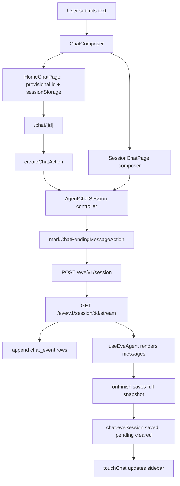

# How the chatbot works

This document explains the eve chat template end to end: where state lives, how messages stream, how interrupted turns resume, and how to change the chat experience without breaking persistence. It is written for maintainers.

The short version: this is not a stateless chat UI. The browser talks to an eve agent through same-origin `/eve/v1/*` routes, persists eve stream events to Postgres as they arrive, keeps an eve session cursor so interrupted streams can resume, and renders a static Next.js shell so the sidebar and composer stay stable during navigation.

## Main pieces

The template has four layers:

1. The eve agent layer in `agent/`
2. The Next.js shell and page layer in `app/`
3. The chat UI components in `components/chat/`
4. The persistence, auth, and rate-limit layer in `lib/`

Important files:

| File | Purpose |
| --- | --- |
| `agent/agent.ts` | Defines the eve agent and model. |
| `agent/instructions.ts` | Builds dynamic instructions; injects the signed-in user's profile and memory when available. |
| `agent/channels/eve.ts` | Configures the eve web channel and its auth adapters. |
| `agent/channels/slack.ts` | Configures the Slack channel with Vercel Connect credentials. |
| `agent/connections/notion.ts` | Notion Model Context Protocol (MCP) connection through Vercel Connect. Linear and Sentry follow the same pattern in their own files. |
| `next.config.ts` | Wraps the app in `withEve(nextConfig)`, which mounts the `/eve/v1/*` routes, and enables Cache Components. |
| `app/(chat)/layout.tsx` | Renders the static chat shell immediately, then streams viewer and sidebar data through Suspense. |
| `app/(chat)/page.tsx` | Root chat route; renders `HomeChatPage`. |
| `app/(chat)/chat/[id]/page.tsx` | Session route; streams the active chat into the client shell. |
| `app/_components/agent-chat-shell.tsx` | Client shell: sidebar state, history pagination, sign-in modal, connection toggles, shared chat context. |
| `app/_components/home-chat-page.tsx` | Root composer; creates a provisional chat and passes the first message to the session route. |
| `app/_components/session-chat-page.tsx` | Session composer, active chat sync, provisional chat creation, controller wiring. |
| `app/_components/agent-chat.tsx` | The eve client bridge: sending, streaming, persistence, resume, pending authorization, display state. |
| `app/_components/types.ts` | `AgentChatController`, controller status, and draft handler types. |
| `components/chat/composer.tsx` | The controlled chat input. |
| `components/chat/message/index.tsx` | Renders eve messages: markdown, reasoning, tools, input requests. |
| `components/chat/sidebar.tsx` | Paginated chat history sidebar. |
| `components/chat/integrations-menu.tsx` | Per-turn connection toggles. |
| `app/actions/chat.ts` | Server actions for chat creation, event persistence, pending state, authorization skip, rate checks. |
| `app/api/chats/route.ts` | Paginated chat history endpoint. |
| `app/api/chats/[id]/route.ts` | Single-chat endpoint used for client-side refreshes. |
| `lib/db/schema/` | Drizzle tables, split by domain: `auth.ts`, `chat.ts`, `memory.ts`, `profile.ts`. |
| `lib/db/queries.ts` | Chat list, chat load, event append, snapshot save, session save, delete. |
| `lib/chat/session.ts` | Browser-side eve client session with persistence hooks. |
| `lib/chat/stream.ts` | NDJSON stream reader with retry and reconnect. |
| `lib/chat/events.ts` | Event log helpers: settled detection, merging, prefix preservation. |
| `lib/chat/connection.ts` | Pending authorization scanning, declined events, per-turn client context. |
| `lib/chat/provisional-chat.ts` | Provisional chat ids and the sessionStorage first-message handoff. |
| `lib/chat/limits.ts` | Message length limit. |
| `lib/chat/sidebar-state.ts` | Sidebar cookie name and serialization. |
| `lib/session.ts` | `getServerViewer`, the safe viewer object for server components and actions. |
| `lib/auth.ts` | Better Auth configuration with Sign in with Vercel. |
| `lib/auth-url.ts` | Base app URL resolution. |
| `lib/eve-auth.ts` | Converts a Better Auth session into an eve channel principal. |
| `lib/rate-limit.ts` | Upstash Redis fixed-window rate limiting. |

## Runtime model

There are two related but separate concepts:

1. A **local app chat**, a row in the `chat` table.
2. An **eve session**, eve's durable `ClientSessionState` plus its remote session stream.

The app chat gives you a stable URL such as `/chat/[id]`, a sidebar title, and a persisted event history. The eve session is the durable conversation state eve uses to continue a turn, wait for authorization, resume streams, and accept follow-up input.

The app stores eve session state on the chat row:

```ts
chat.eveSession: ClientSessionState | null
```

The app stores eve stream events in ordered rows:

```ts
chat_event.eventIndex: number
chat_event.event: MessageStreamEvent
```

Keep these indices separate. `eveSession.streamIndex` tells eve where to resume in the remote session stream. `chat_event.eventIndex` tells Postgres how to order the local event log for rendering. They are not interchangeable.

## Rendering strategy

The app uses the Next.js App Router with Cache Components enabled (`cacheComponents: true` in `next.config.ts`). The chat shell renders immediately while dynamic data streams in behind hidden Suspense boundaries.

### Shell first

`app/(chat)/layout.tsx` renders immediately:

```tsx
<AgentChatShell initialChats={[]} initialNextCursor={null} viewer={null}>
  {children}
  <div aria-hidden className="hidden">
    <Suspense fallback={null}>
      <ResolvedChatBootstrap />
    </Suspense>
  </div>
</AgentChatShell>
```

The shell paints the sidebar frame, top-right auth buttons, and route body without waiting for the database or the auth session. `ResolvedChatBootstrap` then fetches the Better Auth viewer with `getServerViewer()` and the first page of chat history with `listChatsPageByUser(viewer.id)`.

`AgentChatBootstrapSync` stores that data on `window` and dispatches a browser event. `AgentChatShell` listens for the event and merges the viewer and sidebar history into client state. This pattern avoids a blocking route that would delay the whole page.

### Session route data

`app/(chat)/chat/[id]/page.tsx` uses the same pattern:

```tsx
<SessionChatPage chatId={chatId} key={chatId}>
  <Suspense fallback={null}>
    <ExistingChat chatId={chatId} />
  </Suspense>
</SessionChatPage>
```

`ExistingChat` loads the active chat from Postgres with `getChatForUser` and emits it through `AgentChatRouteSync`. For provisional chat ids it skips the database load and syncs `null`. If a signed-in user asks for a chat that does not exist, the route calls `notFound()`.

`SessionChatPage` listens for the sync event and passes the loaded `ActiveChat` into `AgentChatSession`. The top bar, sidebar, and composer stay stable while the chat body waits for data.

## Sidebar state and pagination

`AgentChatShell` owns the sidebar. Its state:

- desktop sidebar open or closed
- mobile sidebar drawer open or closed
- current history page and next cursor
- active chat id
- viewer
- sign-in modal state and the draft saved before sign-in
- enabled connection toggles

The desktop open state persists in a cookie, `SIDEBAR_COOKIE_NAME = "eve-chat-sidebar"` from `lib/chat/sidebar-state.ts`. `SidebarCookieScript` writes an early `data-eve-chat-sidebar` hint on the document element before React hydrates, so the sidebar does not flash open and then collapse.

Chat history is paginated. `ResolvedChatBootstrap` loads the first page; the sidebar loads more from `GET /api/chats?cursor=<cursor>`. `listChatsPageByUser` orders by `updatedAt desc, id desc` and fetches one row beyond the page size of 20 to decide whether a next cursor exists. The cursor encodes as `<updatedAt ISO string>::<chat id>`.

An intersection observer sentinel at the bottom of the list triggers `AgentChatShell.loadMoreChats()`, which appends only chats not already present. Creating, sending to, or deleting a chat updates the sidebar optimistically through `touchChat(chat)`, `removeChat(chatId)`, and `updateChatTitle(chatId, title)`. When bootstrap data arrives, `mergeChatHistory` merges the server page with optimistic entries instead of replacing them.

The shell also renders a share button on `/chat/[id]` routes that copies the chat URL to the clipboard.

## Root page flow

The root route renders `HomeChatPage`: a centered composer and footer links inside the shared shell.

When you submit the first message:

1. The input is trimmed and checked against the 8,000 character limit.
2. If you are signed out, `requestSignIn(message)` opens the sign-in modal and keeps the draft; the modal writes it to sessionStorage before redirecting.
3. If you are signed in, the page generates a provisional chat id with `createProvisionalChatId()` and stores the message in sessionStorage under `eve-chat-pending:<id>`.
4. The app navigates to `/chat/<provisional id>`.

The root page never creates the chat row and never calls eve. The session route creates the row and sends the message, so navigation happens immediately without waiting for a server action.

## Session page flow

The session route renders `SessionChatPage`. It owns the loaded `ActiveChat`, the composer draft, a ref to the `AgentChatController`, route error state, and the pending user message.

For a provisional chat id, `SessionChatPage` reads the pending message from sessionStorage, calls `createChatAction({ pendingUserMessage })`, copies the pending message to the new chat id, and replaces the URL with `/chat/<real id>`. If creation fails, it restores the draft and returns to the root page with an error toast. Provisional pending messages expire after 10 minutes.

For an existing chat id, the route sync delivers the loaded chat. Once you are signed in, `SessionChatPage` also refetches the chat from `GET /api/chats/[id]` on the client, which refreshes the event log after client-side navigations without a full server render.

The `AgentChatController` comes from `AgentChatSession`:

```ts
type AgentChatController = {
  readonly reset: () => void;
  readonly sendMessage: (
    text: string,
    draftHandlers: DraftHandlers
  ) => Promise<void>;
  readonly stop: () => void;
};
```

Alongside the controller, `AgentChatSession` reports a status object: `isBusy`, `isDisabled`, `isEmpty`, and an optional `disabledReason` for the composer tooltip.

If the route has a pending user message, from the database or the provisional handoff, `SessionChatPage` auto-consumes it once the chat has loaded, the controller exists, and the controller is neither busy nor disabled. This is how the first message from the root page gets sent to eve after navigation.

## eve client bridge

Most chat logic lives in `app/_components/agent-chat.tsx`. The core hook:

```tsx
const agent = useEveAgent({
  initialEvents: activeChat?.events ?? [],
  session: persistedSessionRef.current,
  onEvent: persistStreamEvent,
  onFinish: (snapshot) => {
    void persistSnapshot(snapshot);
  },
});
```

`useEveAgent` from `eve/react` reduces eve stream events into renderable messages. The template wraps it with persistence and resume logic.

### Persisted client session

`createPersistedClientSession` in `lib/chat/session.ts` creates the browser session object. It exposes `send(input)`, `stream(options)`, `applyLocalEvents(events)`, `setState(nextSession)`, and `state`.

When `send(input)` runs, it:

1. Posts to `/eve/v1/session` for a new session, or `/eve/v1/session/:sessionId` for a continuation.
2. Reads the session id from the JSON response body, falling back to the `x-eve-session-id` header.
3. Updates the local `SessionState` and reports it through `onSessionStarted`, which saves it to the chat row.
4. Returns a browser-compatible message response whose async iterator reads `/eve/v1/session/:sessionId/stream`.

The app never talks to a model provider directly. It talks to eve's same-origin session API, mounted by `withEve(nextConfig)`.

### Streaming

`streamSessionEvents` in `lib/chat/stream.ts` opens `GET /eve/v1/session/:sessionId/stream?startIndex=<n>` and reads newline-delimited JSON (NDJSON) events. For each event it buffers the event, advances the next remote stream index, yields it to `useEveAgent`, and stops when the event settles the turn.

`isChatTurnSettledEvent` in `lib/chat/events.ts` treats four event types as settling a turn:

- `session.completed`
- `session.failed`
- `session.waiting`
- `authorization.required`

Stream open failures retry up to 12 times, 250 ms apart, for these statuses: 404, 409, 425, 500, 502, 503, 504. Mid-stream disconnects reconnect up to 3 times from the next unread index after a 350 ms delay. If 120s pass with no progress, the reader gives up. When the iterator exits for any reason, `onFinalize(events)` advances the browser session state with the events actually observed.

`namespaceStreamEvent` prefixes each event's `turnId` with the session id, so events from different eve sessions never compare as equal in the local log.

## Sending a message

`AgentChatSession.sendMessage` sends follow-up messages. The order:

1. Ignore empty input, busy sessions, and input over 8,000 characters.
2. If eve waits on a connection authorization, restore the draft and show an error instead of sending.
3. If you are signed out, open the sign-in modal with the draft.
4. Render an optimistic user bubble with `createPendingUserMessage`.
5. Run `prepareSend`: enforce the send rate limit, create the chat row if none exists, and `router.replace` to the chat URL.
6. Mark the chat row with `markChatPendingMessageAction`.
7. Call `agent.send({ message, clientContext })`.
8. Let `useEveAgent`, `onEvent`, and `onFinish` stream and persist.

The optimistic bubble is not a persisted event. When the real eve user message appears in the reduced message list, `hasLatestUserMessage` clears the local bubble. The UI stays immediate while eve produces the canonical event log.

`AgentChatSession` also handles structured input responses: when a tool part renders input controls, `handleInputResponses` sends `agent.send({ inputResponses })` instead of a text message.

## Persistence model

The app persists at three moments:

1. When a session starts (session state)
2. As each stream event arrives (event rows)
3. When the turn finishes (full snapshot)

### Session state persistence

`onSessionStarted` fires right after eve assigns a session id. The handler calls `saveChatSessionStateAction({ chatId, session })`, so the chat row always knows the latest eve session cursor even before the first event arrives.

### Event by event persistence

`persistStreamEvent(event)` writes each event through `appendChatEventAction({ chatId, event, eventIndex })`. `eventIndex` is a local monotonic counter per chat. A unique index on `(chatId, eventIndex)` plus conflict updates means a retried write replaces the same slot. Event-by-event persistence is what makes refresh and resume possible when the browser closes mid-turn.

### Snapshot persistence

When `useEveAgent` finishes a turn, `onFinish(snapshot)` receives the reduced event list and the current `SessionState`. Before saving, `persistSnapshot` merges:

- `mergeStreamEventLogs(knownInitialEvents, streamEvents)` when the turn streamed events, otherwise `preserveKnownInitialEvents(snapshot.events, knownInitialEvents)`
- `mergeLocalEvents(snapshotEvents, localEvents)` for locally synthesized events
- `advanceSessionWithLocalEvents(snapshot.session, localEvents)` for the session cursor

It then calls `saveChatSnapshotAction({ chatId, events, session })`. `saveChatSnapshot` upserts events by index, deletes rows beyond the snapshot length, saves the session state, clears `pendingUserMessage`, and updates the chat timestamp. If the snapshot belongs to a different eve session than the current one (`isSnapshotForCurrentSession`), the save is skipped.

### Why snapshot merging exists

Local events, such as authorization skip events, never arrive from the remote stream. Snapshots from the hook can also start after initial events the app already loaded from Postgres. Prefix-aware merging in `preserveKnownInitialEvents` preserves the correct continuation instead of concatenating arrays. Event comparison uses `isDeepEqualData` from the `ai` package, so JSON key order does not cause false mismatches.

## Pending message recovery

`pendingUserMessage` covers interrupted first sends and interrupted follow-ups:

1. Before sending to eve, the app calls `markChatPendingMessageAction`.
2. The chat row stores `pendingUserMessage` and `pendingUserMessageCreatedAt`.
3. If the page refreshes before the turn completes, `getChatForUser` returns the pending message.
4. `SessionChatPage` consumes it once the controller is ready.
5. If a settled event exists at or after `pendingUserMessageCreatedAt`, `getChatForUser` hides the stale pending message.
6. `saveChatSnapshot`, `clearChatPendingMessageAction`, and `skipChatAuthorization` clear pending state.

This recovers from the case where the UI accepted the message but the browser left before eve finished.

## Refresh and resume

If you refresh during an in-progress turn, the app resumes from the saved eve session. `AgentChatSession` resumes when there is a viewer, the loaded chat has a `session.sessionId`, resume has not already started, `useEveAgent` is ready, and either a `pendingUserMessage` exists or the loaded events contain an open turn (`hasOpenChatTurn`: a `turn.started` with no later settling event).

It then streams from a temporary persisted client session:

```ts
session.stream({
  ignoreLeadingWaiting,
  signal: abortController.signal,
  startIndex: activeChat.events.length,
});
```

`ignoreLeadingWaiting` skips a stale leading `session.waiting` event when the pending message is not yet in the event log. Each resumed event is appended to local resume overlay state and written to `chat_event`. When a settling event arrives, the app saves the full snapshot and clears pending state. If the stream ends without a settling event, the app shows “Stream disconnected before the response completed.”

The resume overlay exists because the main `useEveAgent` instance initialized from the loaded events; resumed events layer on top until the snapshot catches up.

## Authorization flow for connections

eve emits structured authorization events; the app never parses assistant text for auth requirements. When a connection needs auth, eve emits `authorization.required`. `getPendingAuthorizations(displayEvents)` adds a pending entry per `authorization.required` and removes it when a matching `authorization.completed` appears.

Each pending authorization renders a `ConnectionAuthorizationPrompt` with the connection display name, a description, a Connect link when eve provides one, and a Skip button. While an authorization is pending, regular chat input is disabled for that session, because eve waits for a structured outcome rather than a normal user message.

### Connect

Connect opens the authorization URL from eve. After you authorize the connection, eve receives the callback and continues the turn; the browser stream receives the next events for the same eve session.

### Skip

Skip ends the authorization wait locally without connecting the service. `handleSkipAuthorization`:

1. Builds declined events with `createAuthorizationDeclinedEvents`: an `authorization.completed` event with outcome `declined` and reason `skipped`, plus a synthetic `session.waiting`.
2. Stops the current stream and resets the persisted browser session to a fresh initial state.
3. Applies the events to local overlay state and saves them with `skipChatAuthorizationAction`, which appends them after the last event index and clears pending state.
4. On failure, restores the previous session state and removes the local events.

Skip ends the current turn. Your next message starts a fresh turn with the updated context.

## Connections menu

`ComposerFooterControls` renders `IntegrationsMenu` in the composer footer. The menu lists three toggles: Notion, Linear, and Sentry. All three default to off. `AgentChatShell` holds the state as `enabledConnections` and shares it through `ChatShellProvider`.

Each send passes a natural-language `clientContext` built by `createConnectionClientContext(enabledConnections)`. It tells eve which connections you enabled for this turn and names the disabled ones the model must not use. The toggle controls per-turn agent behavior only; it does not provision or revoke a Vercel Connect connector.

The MCP connectors live in `agent/connections/`. Notion, for example:

```ts
const notionConnector = process.env.NOTION_CONNECTOR ?? "notion/myagent";

export default defineMcpClientConnection({
  url: "https://mcp.notion.com/mcp",
  description: "Notion workspace: search and edit pages and databases.",
  auth: connect(notionConnector),
});
```

For production, set `NOTION_CONNECTOR`, `LINEAR_CONNECTOR`, and `SENTRY_CONNECTOR` to the Vercel Connect connector UIDs. For local development, each connection file documents the `vercel connect create` command whose connector name matches the fallback.

## Authentication

The app uses Better Auth with Sign in with Vercel. `lib/auth-url.ts` resolves the base app URL in this order:

1. `BETTER_AUTH_URL`
2. `VERCEL_PROJECT_PRODUCTION_URL`
3. `VERCEL_URL`
4. `http://localhost:3000`

`lib/auth.ts` configures Better Auth with the Drizzle adapter, encrypted OAuth tokens, account linking that trusts the Vercel provider, the Vercel social provider with scopes `openid`, `email`, `profile`, and `/auth/error` as the error page. A missing `BETTER_AUTH_SECRET` throws at startup.

`lib/session.ts` exposes `getServerViewer()`, which returns a small `Viewer` object for server components and `null` when there is no session or the session lookup fails.

`lib/eve-auth.ts` adapts the Better Auth session into an eve channel principal:

```ts
{
  authenticator: "better-auth",
  issuer: "better-auth",
  principalType: "user",
  principalId: session.user.id,
  subject: session.user.email,
  attributes: {
    email: session.user.email,
    name: session.user.name,
  },
}
```

`agent/channels/eve.ts` accepts three auth adapters in order: `betterAuthEveAuth`, `vercelOidc()` for Vercel OpenID Connect (OIDC) bearer tokens, and `localDev()` for loopback requests. The same channel serves local development, authenticated browser sessions, and Vercel OIDC contexts. Uploads are disabled with `uploadPolicy: "disabled"`.

## Rate limiting

`lib/rate-limit.ts` uses Upstash Redis. It reads `UPSTASH_REDIS_REST_URL` and `UPSTASH_REDIS_REST_TOKEN`, falling back to the legacy Vercel KV names `KV_REST_API_URL` and `KV_REST_API_TOKEN`. If neither pair is set, `enforceRateLimit` throws, so sends fail loud instead of running unthrottled.

`enforceRateLimit` uses a fixed window key, `rate:<prefix>:<viewer id>:<window id>`, incremented with `INCR` and given a `EXPIRE` on the first hit. Current limits:

- `chat:create`: 25 per hour
- `chat:send`: 25 per hour, checked by `checkSendLimitAction` before each send
- Message length: 8,000 characters (`MAX_CHAT_MESSAGE_CHARS`)

Create and send limits are separate so chat creation and message sending throttle independently. The composer checks message length first; server actions check it again before creating chats or saving pending messages.

## Message rendering

`useEveAgent` reduces stream events into message data; `components/chat/message/index.tsx` renders it. Supported output:

- user bubbles
- assistant markdown through Streamdown with code, math, and mermaid plugins
- reasoning parts
- dynamic tool parts and tool input controls
- optimistic pending user messages
- a standalone Thinking presence row

User messages render as rounded right-aligned bubbles; assistant messages render full width on the left. Consecutive dynamic tool parts group into one compact row, expandable when the row has useful details or input controls. Reasoning parts render as a collapsible block that reads “Thinking…” with shimmer text while streaming and “Reasoning” afterward. The standalone `ThinkingMessage` appears while the session is busy before assistant text arrives, and fades out over 180 ms instead of disappearing abruptly.

## Composer behavior

`components/chat/composer.tsx` is a controlled component. Pages pass `value`, `onChange`, `onSubmit`, `onStop`, `disabled`, `disabledReason`, `isBusy`, and `isPreparing`, plus optional `autoFocus`, `footerStart`, `maxLength`, and `placeholder`.

The composer:

- auto-focuses when enabled (the default)
- submits on Enter, inserts a newline on Shift+Enter
- blocks submits over `maxLength` (8,000 characters by default)
- disables the textarea while a request is in flight
- shows a stop icon while busy and a spinner while preparing
- wraps disabled states in a tooltip that shows `disabledReason`

Root and session pages render the same composer in different layouts: centered on the root page, pinned near the bottom on session routes.

## Error handling

Request failures surface as `ErrorToast` notifications, not inline layout blocks, so errors never push the composer or chat body around. Configuration problems fail loud: a missing `BETTER_AUTH_SECRET` throws at startup, and missing Redis env vars throw on the first send.

Common stream errors:

- stream disconnected before a settling event
- eve session missing when trying to resume
- rate limit exceeded; the toast includes the retry delay
- chat row creation failing for a provisional chat; the draft is restored

The app prefers toasts for recoverable request failures, a disabled composer with a tooltip reason while a turn finalizes, and structured auth cards for connection blockers.

## Event log invariants

1. `chat_event.eventIndex` is unique per chat.
2. A completed snapshot overwrites stale event rows by index.
3. Rows beyond the final snapshot length are deleted.
4. `pendingUserMessage` is cleared after a settled turn.
5. Local authorization skip events are merged into final snapshots.
6. A pending authorization disables normal text input for that session.
7. A route change resets per-chat refs such as event index and local pending messages.
8. The sidebar updates optimistically; the event log stays the source of truth for chat content.

When debugging “messages replaced old messages” or “a response changed after it looked complete”, inspect these first:

- two events written to the same local `eventIndex`
- `preserveKnownInitialEvents` duplicating or dropping a prefix
- `pendingUserMessage` left on the chat row after a settling event
- the eve stream ending with `session.waiting` before the UI expected it
- a local optimistic message cleared before the real user event appeared
- an `authorization.required` event settling the turn earlier than expected

## Adding a new tool

1. Create a file in `agent/tools/`.
2. Export a `defineTool(...)`.
3. Register it following eve's agent conventions.
4. Update the base instructions in `agent/lib/base_instruction.ts` so the agent knows when to use it.
5. If the UI needs a special tool state, update `components/chat/message/tool-parts.tsx` for the status icon, name label, payload, and input-request actions, or `tool-group.tsx` for row grouping.

Keep tool output structured. The message renderer makes better UI decisions when tool parts contain predictable JSON instead of prose.

## Adding a new connection

To add another Vercel Connect-backed MCP connection:

1. Add `agent/connections/<name>.ts` with `defineMcpClientConnection`.
2. Use `connect(process.env.<ENV_NAME> ?? "<fallback-name>")`.
3. Document how to provision the connector.
4. Extend `EnabledConnections` in `lib/chat/types.ts`.
5. Add a toggle in `components/chat/integrations-menu.tsx`.
6. Update `createConnectionClientContext` in `lib/chat/connection.ts` so eve receives per-turn intent.
7. Verify `authorization.required` events render correctly.

Do not parse assistant text to detect auth requirements. Rely on `authorization.required` and `authorization.completed` events.

## Adding a new channel

This template exposes a web chat channel through `agent/channels/eve.ts` and a Slack channel through `agent/channels/slack.ts`. If you add another channel, keep this separation:

- channel webhook or transport code belongs in `agent/channels/`
- web chat UI state belongs in `app/_components/` and `components/chat/`
- cross-channel agent behavior belongs in `agent/lib/base_instruction.ts`, tools, and connections

The web chat persistence code is tied to the browser experience on purpose. Do not reuse it as a generic state adapter for another channel without checking that channel's message and session semantics.

## Development checklist

When you change the chat flow, verify:

1. The root page renders without layout shift.
2. Signed-out users can type, then get the sign-in modal, and their draft survives.
3. The first message navigates to a provisional chat, creates the row, and streams.
4. Follow-up messages appear optimistically.
5. Assistant text streams without replacing older messages.
6. Refreshing mid-response resumes or ends with a clear error.
7. The sidebar stays visible and the active row state is correct.
8. Sidebar pagination loads older chats.
9. A pending authorization disables only the affected session.
10. Connect and Skip both leave the conversation usable.
11. `pnpm typecheck` and `pnpm build` pass.

## Mental model

Think of the app as a small durable chat runtime:



The browser can be interrupted at any point. Postgres keeps enough state to rebuild the UI and continue from eve's stream cursor. The static shell keeps navigation smooth. The final snapshot keeps the event log canonical.
